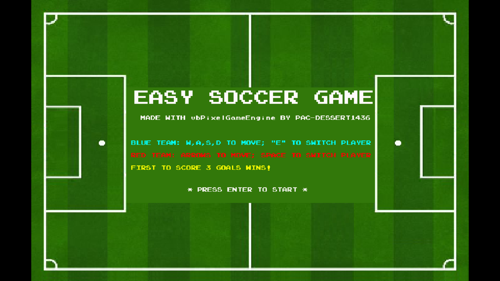

# Easy Soccer Game Built with `vbPixelGameEngine`



## Description
This is a simple soccer game built with `vbPixelGameEngine`. It's a 2D game where two players control soccer players to compete for the ball and score goals against each other. *__The objective is to be the first to score 3 goals, regardless of the game's duration.__*

The project uses the experimental `SpriteSheet` class for loading and managing game sprites, along with a `RectF` structure to track player and ball positions, enabling more precise collision detection and response. Audio playback is handled by a custom `SoundPlayer` class using the NAudio library, ensuring a smooth, immersive experience.

Except for the soccer field image downloaded from the Internet (and later adjusted using Aseprite), all in-game visuals are handcrafted with Aseprite. The background music is "Route 38" from the *Pokémon HeartGold & Pokémon SoulSilver Super Music Collection*, while sound effects are sourced from the original NES Soccer game (except the scoring sound which is actually from the Game Gear version of _Sonic the Hedgehog 2_).

A current limitation is the absence of the offside rule. While critical in real soccer, implementing it proved more complex than initially anticipated.

## Controls
- Player 1 (Blue team): W, A, S, D to move; 'E' to switch players
- Player 2 (Red team): Arrow keys to move; Spacebar to switch players
- Hotkeys: 'P' to pause or resume; 'ESC' to quit

## Prerequisites
- [vbPixelGameEngine](https://github.com/DualBrain/vbPixelGameEngine)
- [.NET SDK](https://dotnet.microsoft.com/download): version 9.0 or later
- Required NuGet packages:
  - NAudio 2.2.1
  - System.Drawing.Common 9.0.0+

## Installation
1. Clone the repository and navigate to the project directory:
```
git clone https://github.com/Pac-Dessert1436/VBPGE-Easy-Soccer-Game.git
cd VBPGE-Easy-Soccer-Game
```
2. Restore dependencies:
```
dotnet restore
```
3. Build and run:
```
dotnet build
dotnet run
```

## Personal Notes
I created this soccer game in honor of Mr. Zhou, an outstanding alumnus from my college's Class 192 in Biotechnology. We met just before my second semester as a freshman, and he's now in his third year of postgraduate studies, approaching job hunting.

I cherish the many moments we've shared, celebrating small wins and commiserating over setbacks. He's always admired my short-term achievements and creative work (like photography and watercolors) and encouraged me to face challenges bravely when I felt discouraged.

Though I performed poorly in this year's Postgraduate Entrance Exam, Mr. Zhou has reminded me of the importance of finding healthy ways to relax after hard work. "The best ways to regulate your emotions are doing sports, reading a book, and organizing your space," he said. He also urged me to confront difficulties proactively, whether tough tasks or social interactions.

My life plans remain unclear, but Mr. Zhou has given me invaluable insight and emotional support. *__He's right: life has ups and downs, and perfection isn't realistic - I must stay committed to my chosen path, whatever it brings.__* I sincerely hope I could offer him the same support in return, even as our lives take different directions. I look forward to the day we could meet again, smiling and shaking hands.

## License
This project is licensed under the MIT License. See the [LICENSE](LICENSE) file for details.